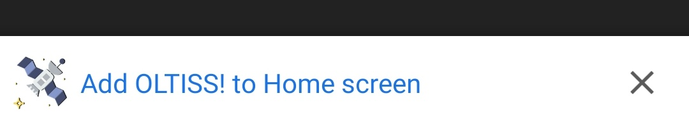

<h1 align="center">OLTISS!</h1>

 An extremely basic <b>Progressive Web App</b> that shows the location of the international space station. 
  

<h1></h1>

**Installation:**

1. Visit [this](https://github.com/akshay-99/OLTISS) in your phone browser
1. Tap on the **add to home screen** popup
1. Et-voilà, you have successfully installed OLTISS.

<h1></h1>

Note: This app is just to learn the concepts and to prepare oneself for teaching at the PWA Workshop. It is not a show of skills

